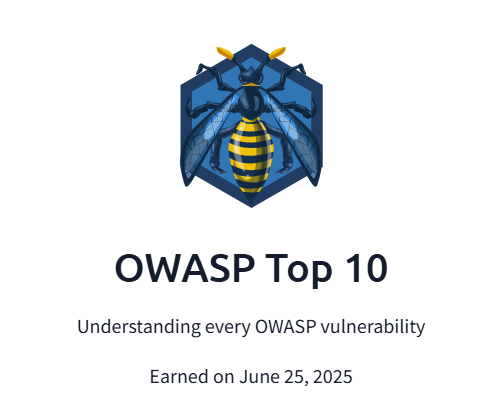

# OWASP Top 10 Report – TryHackMe 🛡️

This repository contains my completed OWASP Top 10 lab report from [TryHackMe](https://tryhackme.com/), where I explored the most common web application vulnerabilities and practiced exploiting them in a hands-on environment.

---

## 📌 Topics Covered
- Injection
- Broken Authentication
- Cross-Site Scripting (XSS)
- Insecure Deserialization
- Broken Access Control
- Security Misconfigurations
- Sensitive Data Exposure
- Insufficient Logging and Monitoring
- Using Components with Known Vulnerabilities
- XML External Entities (XXE)

---

## 🏆 Badge Earned  

---

## 📄 Full Report  
[👉 Click here to view the OWASP Top 10 Report](OWASP_Top_10_TryHackMe_Report.pdf)

---

## 🔐 Author
**Rishi Bose**  
[🔗 LinkedIn](https://www.linkedin.com/in/rishi-bose-738961250)
